# StreamFlow — Análise Crítica de Arquitetura de Microsserviços

**Disciplina:** Serviços Web  
**Entrega:** 08/05/2026
**Alunos:**  Igor, Leopoldo e Wagner. 
---

## Preparação do Ambiente

### Fork e clone do repositório

O primeiro passo foi fazer o fork do repositório e clonar localmente.

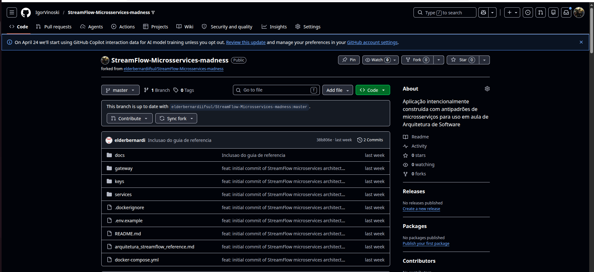

### Subindo os serviços

```bash
sudo docker compose up --build
```

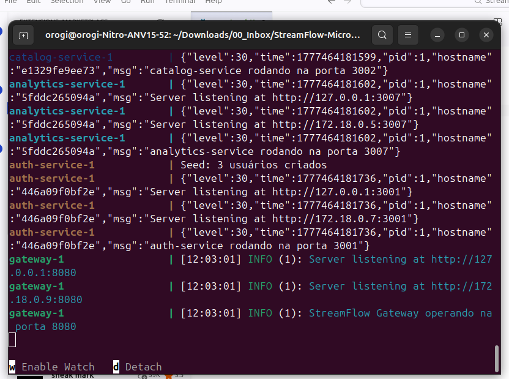

### Bug encontrado no gateway — e corrigido

Ao consumir o health check do gateway logo após subir, o endpoint retornou erro:

```
GET http://localhost:8080/health
```

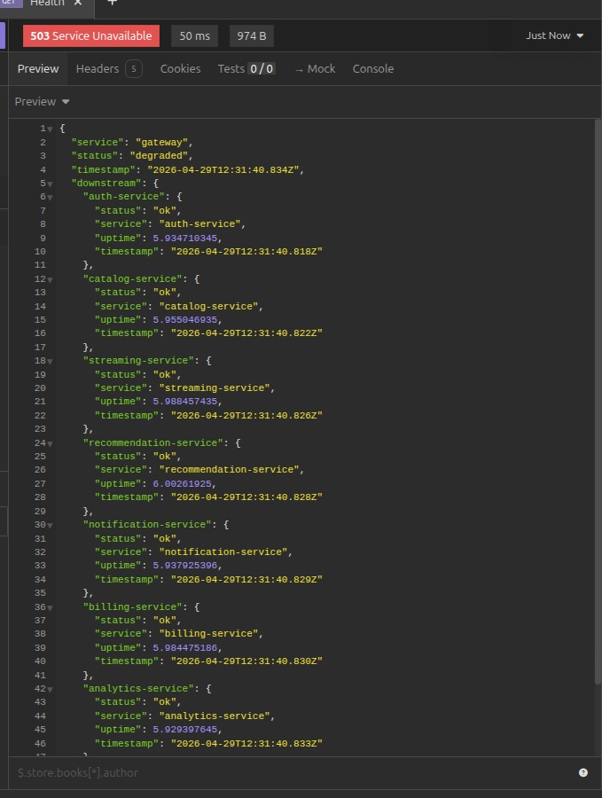

A causa foi identificada diretamente no código do gateway:

```js
// Código original — com bug
const allUp = Object.values(results).every(r => r.status === 'up');
```

Os serviços internos respondem com `"status": "ok"`, mas o gateway comparava com `"up"` — comparação que nunca seria verdadeira. O gateway sempre retornaria `degraded` mesmo com tudo funcionando. A correção foi simples:

```js
// Código corrigido
const allUp = Object.values(results).every(r => r.status === 'ok');
```

Após a correção, o health check passou a responder corretamente:

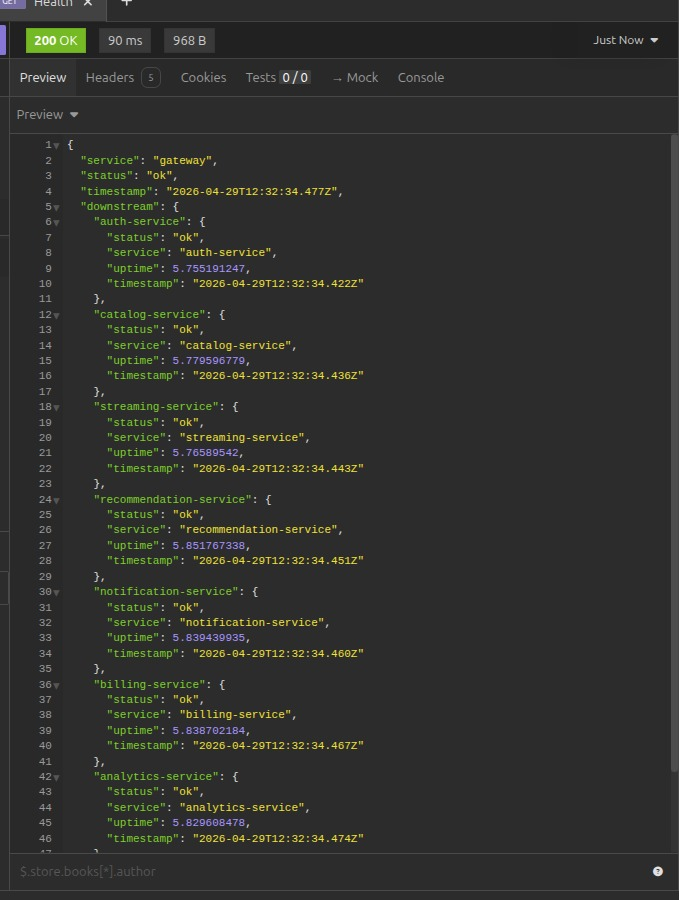

> **Observação:** esse bug revela um problema de observabilidade real — a equipe poderia estar monitorando um endpoint que sempre reporta degradação sem perceber, criando ruído nos alertas e falsa sensação de problema constante.

### Autenticação

Com os serviços rodando, o login funcionou corretamente:

```
POST http://localhost:8080/auth/login
```

```json
{
  "token": "eyJhbGciOiJSUzI1NiIsInR5cCI6IkpXVCJ9...",
  "user": {
    "id": "user_1",
    "name": "Ana Silva",
    "role": "admin"
  }
}
```

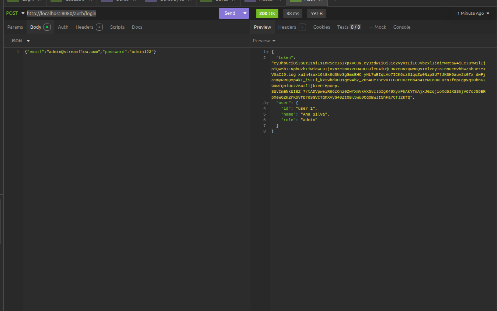

Token JWT RS256 emitido com sucesso. A partir daqui, todos os cenários de teste usaram esse token no header `Authorization: Bearer`.

---

## Cenários de Teste

### Cenário 1 — Latência da Cadeia Síncrona

**Objetivo:** medir o custo real da cadeia síncrona no fluxo de Play e comparar com uma rota simples.

**Chamada complexa — POST /streaming/play:**

```
POST http://localhost:8080/api/streaming/play
Body: { "movieId": 2 }
```

Resposta:

```json
{
  "sessionId": 6,
  "movie": "Interestelar",
  "status": "playing",
  "message": "Reprodução iniciada."
}
```

**Tempo médio medido: ~300ms**

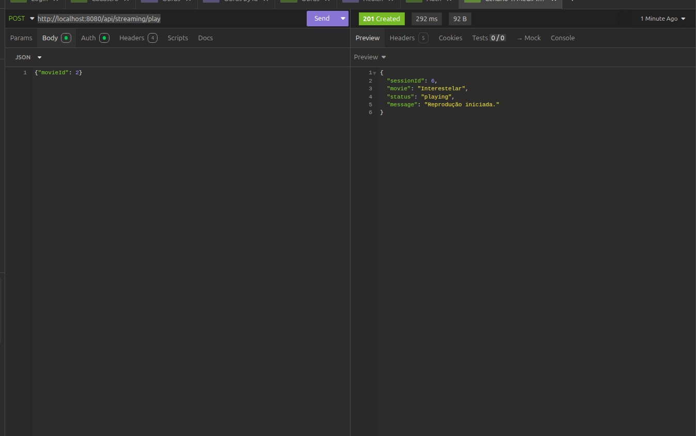

**Chamada simples — GET /catalog:**

```
GET http://localhost:8080/api/catalog
```

**Tempo médio medido: ~30ms**

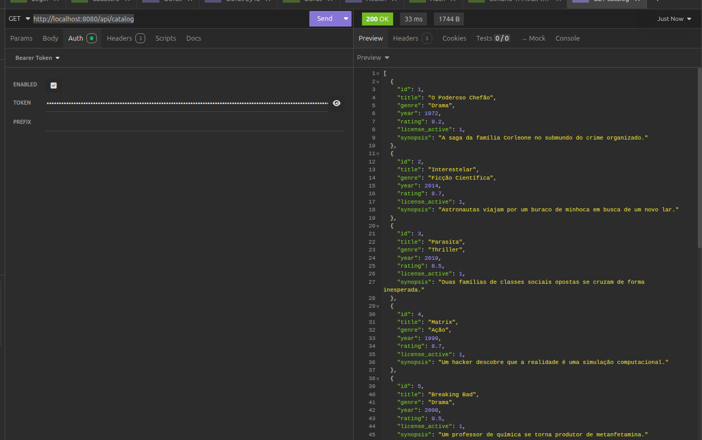

**Análise:** a diferença de ~270ms entre as duas chamadas é o custo direto da cadeia síncrona. O Play encadeia três chamadas bloqueantes antes de responder — catalog (verificação de licença), recommendation (registro de histórico) e notification (envio de alerta). O usuário espera o resultado de todas elas antes de ver qualquer resposta. Das três, apenas a verificação de licença precisa ser síncrona. As outras duas poderiam ser assíncronas, eliminando a maior parte dessa latência.

---

### Cenário 2 — Notification como Ponto de Falha

**Objetivo:** demonstrar o que acontece quando o notification-service fica indisponível.

Primeiro, o serviço foi parado:

```bash
docker compose stop notification-service
```


Em seguida, uma nova requisição de Play foi feita normalmente. O resultado para o usuário foi sucesso — mas os logs contaram uma história diferente:

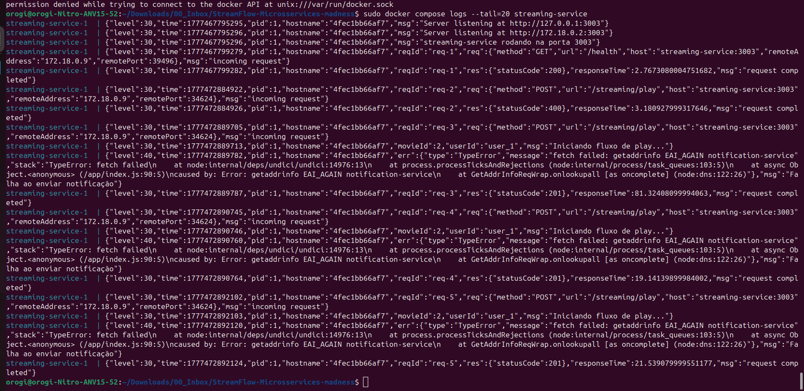

```
streaming-service-1 | {"level":30,...,"msg":"Iniciando fluxo de play..."}
streaming-service-1 | {"level":40,...,"err":{"type":"TypeError",
  "message":"fetch failed: getaddrinfo EAI_AGAIN notification-service"},
  "msg":"Falha ao enviar notificação"}
streaming-service-1 | {"level":30,...,"res":{"statusCode":201},
  "responseTime":21.53,"msg":"request completed"}
```

**Análise:** o streaming-service registrou `level:40` (warning) pela falha na notificação, mas ainda assim retornou `statusCode: 201` ao usuário. Isso é o chamado *fail silencioso* — a operação principal funcionou, mas o efeito colateral falhou sem que ninguém fosse alertado de forma proativa. 

O problema se torna crítico quando a falha ocorre em um serviço que *é* essencial — como o catalog para verificação de licença. Nesse caso, sem timeout configurado, o streaming-service ficaria bloqueado aguardando uma resposta que nunca chega, travando a thread e potencialmente derrubando o serviço inteiro por esgotamento de recursos.

---

### Cenário 3 — Banco Compartilhado entre Billing e Analytics

**Objetivo:** provar que o analytics-service está acoplado diretamente ao banco do billing-service, violando o princípio de banco isolado por serviço.

O billing foi parado:

```bash
docker compose stop billing-service
```

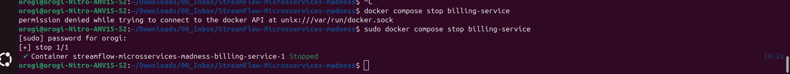

Em seguida, o analytics foi consultado normalmente:

```
GET http://localhost:8080/api/analytics/report
```

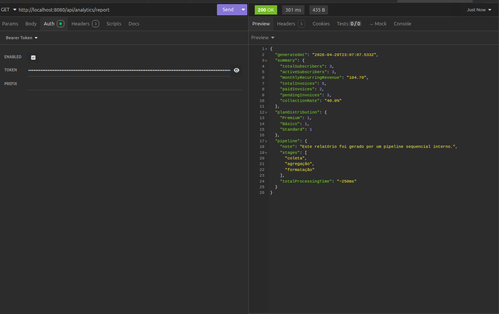

**Análise:** o analytics continuou respondendo com dados completos de assinaturas e faturas mesmo com o billing completamente fora do ar. Isso só é possível porque o analytics não consome a *API* do billing — ele lê diretamente o arquivo `shared_billing.db` via volume Docker compartilhado.

Essa é a definição de acoplamento pelo banco: dois serviços que teoricamente são independentes na camada de aplicação, mas que compartilham o mesmo armazenamento físico. As consequências práticas são:

- O billing não pode evoluir seu schema sem quebrar o analytics silenciosamente
- Não é possível fazer deploy independente dos dois serviços com segurança
- O analytics não tem domínio de dados próprio — ele é um parasita do billing

---

### Cenário 4 — Health Check Agregado

**Objetivo:** verificar como o gateway reporta o estado da plataforma com serviços indisponíveis.

Como os cenários anteriores já haviam derrubado billing e notification, o health check foi consultado nesse estado:

```
GET http://localhost:8080/health
```

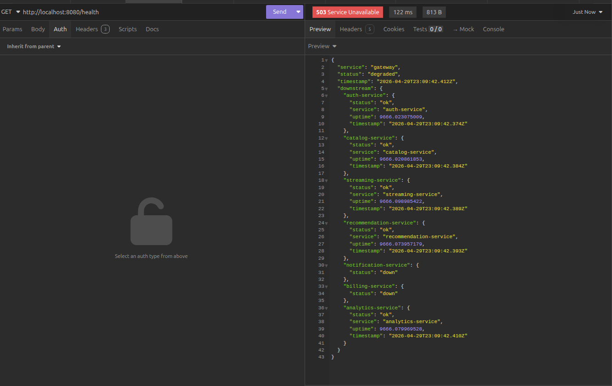

**Análise:** com serviços down, o gateway retornou `HTTP 503` com `"status": "degraded"` e listou individualmente quais serviços estavam fora. Isso é a funcionalidade correta — o problema é que esse foi o *único* mecanismo de observabilidade que funcionou durante os testes. Não há correlation IDs propagados, não há tracing distribuído, não há métricas de latência. O health check informa *se* os serviços estão de pé, mas não consegue responder *por que* um incidente aconteceu, *quanto* durou ou *quantos usuários* foram afetados.

---

## Seção 1 — Custo Operacional Oculto

> *"Temos mais gente mantendo infraestrutura do que escrevendo features."*

O gerente está certo. O custo não subiu por crescimento de usuários — subiu por overhead operacional que não entrega valor proporcional.

**O inventário atual:**

| Serviço | Banco | Justificativa como microsserviço |
|---|---|---|
| gateway | — | ✅ Ponto de entrada único, essencial |
| auth-service | auth.db | ✅ Domínio de identidade, sensível |
| catalog-service | catalog.db | ✅ Conteúdo evolui independente |
| streaming-service | streaming.db | ✅ Núcleo do negócio |
| recommendation-service | recommendation.db | ⚠️ Poderia ser módulo do streaming |
| notification-service | **nenhum** | ❌ Stateless, sem domínio próprio |
| billing-service | shared_billing.db | ✅ Domínio financeiro |
| analytics-service | shared_billing.db | ❌ Banco compartilhado, pipeline interno |

Cada serviço carrega: 1 Dockerfile, 1 pipeline de CI/CD, 1 configuração de rede, variáveis de ambiente, endpoint `/health` a monitorar. Com 8 componentes, isso é ~40 variáveis de ambiente e 8 pipelines para uma equipe de 15 pessoas.

**Candidatos à consolidação:**

O `notification-service` é stateless (sem banco), não tem domínio de negócio próprio e é chamado de forma síncrona — exatamente o oposto do que justifica um microsserviço. Deveria ser uma chamada assíncrona (fila/evento) disparada internamente pelo streaming-service.

O `analytics-service` compartilha banco com o billing e opera um pipeline sequencial interno. Não tem API consumida por outros serviços, não precisa escalar de forma independente e não pode ser deployado sem coordenação com o billing. Deve ser consolidado como módulo interno do billing-service.

**Ação:** consolidar de 8 para 5–6 componentes. Estimativa de redução de 25–30% no custo de infraestrutura.

---

## Seção 2 — Latência de Rede

> *"Um clique no Play toca 12 serviços antes do vídeo iniciar."*

O gerente exagerou no número — são 3 hops síncronos, não 12 — mas o problema é real e foi medido. O fluxo de `POST /streaming/play` encadeia:

| Etapa | Chamada | Justifica bloqueio? | Latência medida |
|---|---|---|---|
| 1 | Catalog — verificação de licença | ✅ Sim | ~10ms |
| 2 | Recommendation — registrar histórico | ❌ Não | ~10ms |
| 3 | Notification — enviar alerta | ❌ Não | 100–300ms (simulado) |

O resultado medido em ambiente local: **~300ms no Play vs ~30ms no Catalog** — 10x mais lento, com 270ms sendo overhead puro de chamadas que não precisam ser síncronas.

**Proposta:** manter a verificação de licença síncrona (é uma restrição de negócio). Converter o registro de histórico para evento assíncrono (fire-and-forget com BullMQ/Redis). Eliminar o notification-service como serviço independente e tratar notificações como evento assíncrono. Resultado esperado: latência do Play cai para ~30–40ms.

---

## Seção 3 — Observabilidade Frágil

> *"Tivemos 3 incidentes e não sabemos nem onde foi."*

O gerente está completamente certo, e os testes confirmaram. Durante toda a execução dos cenários, o único mecanismo de correlação disponível foi olhar log por log em cada serviço manualmente.

O bug encontrado no health check (comparação `'up'` vs `'ok'`) é um sintoma direto disso: um sistema com observabilidade saudável teria alertas que teriam detectado que o health check sempre retornava `degraded`, mesmo sem falhas reais.

**O que falta:**

| Capacidade | Status |
|---|---|
| Correlation ID propagado entre serviços | ❌ Ausente |
| Tracing distribuído | ❌ Ausente (saiu com Rafael e Camila) |
| Métricas de latência por serviço | ❌ Ausente |
| Alertas automáticos de erro | ❌ Ausente |
| Cálculo de usuários afetados por incidente | ❌ Ausente |
| Health check funcional | ✅ Presente, mas tinha bug |

**Proposta em etapas:**

1. **Correlation ID** — implementar no gateway um header `x-correlation-id` (UUID v4) propagado para todos os serviços downstream. Custo: ~2h. Resolve o rastreamento básico entre serviços.
2. **Logging padronizado** — todos os serviços já usam Pino/JSON. Padronizar campos obrigatórios: `correlation_id`, `service`, `duration_ms`, `user_id`.
3. **OpenTelemetry + Jaeger** — instrumentar com `@opentelemetry/sdk-node` e exportar traces para Jaeger (open source, deploy via Docker). Permite visualizar o caminho completo de qualquer requisição.
4. **Prometheus + Grafana** — expor métricas via `fastify-metrics` e criar dashboards com latência P95, taxa de erros e uptime por serviço.

---

## Seção 4 — Consistência Eventual

> *"Recomendações mostrando conteúdo que já foi removido."*

O gerente está certo. A ausência de propagação de eventos entre serviços cria janelas de inconsistência que afetam diretamente a experiência do usuário.

**O cenário crítico:** quando um filme é removido do `catalog-service`, o evento não é propagado para nenhum outro serviço. O `recommendation-service` continua armazenando aquele `movie_id` em `view_history` e `user_preferences`. O resultado é o usuário clicar numa recomendação e receber erro 404 ou conteúdo sem licença ativa.

**Níveis de consistência necessários por domínio:**

| Operação | Consistência | Justificativa |
|---|---|---|
| Verificação de licença no Play | Forte | Questão legal/contratual |
| Autenticação | Forte | Segurança |
| Remoção de catálogo → recommendations | Eventual (< 30s) | Delay curto é aceitável |
| Registro de histórico após Play | Eventual (segundos) | Usuário não percebe |
| Notificações | Eventual (minutos) | Efeito colateral tolerante |
| Relatórios de analytics | Eventual (horas) | Batch, não real-time |

**Proposta:** implementar eventos de domínio publicados pelo `catalog-service` em remoções. O `recommendation-service` escuta esses eventos e invalida os registros afetados. Tecnologia sugerida: Redis Pub/Sub — já comum em stacks Node.js e de baixo custo operacional.

---

## Seção 5 — Lei de Conway

> *"Mesma equipe de 15 pessoas operando 7 serviços."*

A Lei de Conway diz que a arquitetura de um sistema tende a espelhar a estrutura de comunicação da organização que o produz. Com 15 pessoas e 8 componentes, a razão é de 1,9 pessoas por componente — abaixo do mínimo recomendado para manter conhecimento distribuído.

A saída de Rafael e Camila não foi só perda de mão de obra: foi perda do conhecimento sobre as camadas mais críticas e menos documentadas da infraestrutura (tracing e service mesh). Três incidentes sem diagnóstico em duas semanas confirmam que o conhecimento estava concentrado, não distribuído.

**Reorganização proposta:**

| Time | Pessoas | Responsabilidade |
|---|---|---|
| Core (Plataforma) | 5 | Gateway + Auth + Streaming |
| Conteúdo | 5 | Catalog + Recommendation |
| Negócio | 5 | Billing + Analytics (consolidado) |

Três times, cada um com domínio claro e autonomia real. A consolidação dos serviços (Seção 1) é pré-condição para essa reorganização funcionar — não faz sentido um time de 5 pessoas manter 3 serviços com os antipatterns atuais.

**Ações complementares:** documentar Architecture Decision Records (ADRs) antes de qualquer migração, criar runbooks de resposta a incidentes por serviço, e implementar pair programming obrigatório para features críticas de infraestrutura.

---

## Seção 6 — O Caso Prime Video

> *"O concorrente fez melhor com menos."*

A equipe do Prime Video consolidou um pipeline de monitoramento de qualidade de vídeo que havia sido decomposto em microsserviços. O pipeline era sequencial — cada etapa dependia da anterior — e o custo de infraestrutura entre as etapas era desproporcional ao valor entregue. A consolidação em um único processo reduziu custos em 90%.

O análogo direto no StreamFlow é o `analytics-service`. O próprio código do serviço documenta isso:

```js
// analytics-service/index.js
// ── ETAPA 1: Coleta (lê DIRETAMENTE do banco do billing) ──
// ── ETAPA 2: Agregação (depende da etapa 1) ──
// ── ETAPA 3: Formatação (depende da etapa 2) ──
// PIPELINE SEQUENCIAL (caso Prime Video)
```

Não existe nenhum benefício em manter esse pipeline como microsserviço independente. Ele não tem domínio de negócio próprio, não precisa escalar independentemente (relatórios são batch), não pode ser deployado sem coordenação com o billing, e não tem API consumida por outros serviços.

**Outros candidatos:**

| Serviço | Consolidar? | Destino |
|---|---|---|
| analytics-service | ✅ Sim — alta prioridade | Módulo interno do billing |
| notification-service | ✅ Sim — alta prioridade | Evento assíncrono no streaming |
| recommendation-service | ⚠️ Opcional | Avaliar no médio prazo |

**Arquitetura final proposta:** gateway, auth, catalog, streaming, recommendation, billing (com analytics interno) — 6 componentes, sem antipatterns de banco compartilhado, sem pipeline sequencial disfarçado de microsserviço.

---

## Bônus — Moleculer.js

> *"Pesquise e me diga: o que ele resolve de graça, o que ele esconde, e se vale a pena migrar."*

### O que o Moleculer resolve nativamente

O Moleculer é um framework de microsserviços para Node.js que entrega nativamente o que hoje o StreamFlow não tem:

| Funcionalidade | Moleculer | StreamFlow hoje |
|---|---|---|
| Service Discovery | Automático via transporter | Manual, via variáveis de ambiente |
| Circuit Breaker | Nativo por action | Ausente |
| Retry com backoff | Nativo | Ausente |
| Timeout por action | Nativo | Ausente |
| Fallback | Nativo | Ausente |
| Tracing distribuído | OpenTelemetry integrado | Ausente |
| Métricas Prometheus | Nativas | Ausentes |
| Comunicação assíncrona | Eventos via NATS/Redis/Kafka | Não implementada |

### O que o Moleculer esconde — e por que isso é perigoso

O vídeo de referência alerta para um padrão recorrente: frameworks que abstraem complexidade de infraestrutura não eliminam essa complexidade — apenas a tornam invisível. Quando algo quebra, a equipe não sabe depurar porque não entende as camadas que o framework gerencia por baixo.

No Moleculer especificamente:

**Service discovery automático via broker:** se o broker (NATS, Redis) cair, todos os serviços ficam cegos entre si simultaneamente. A StreamFlow já perdeu dois tech leads que entendiam o service mesh atual — o Moleculer criaria uma dependência semelhante no broker, com a diferença de que agora a complexidade estaria em uma biblioteca externa, não em código próprio.

**Circuit breaker opaco:** o circuito abre e fecha automaticamente. Sem observabilidade, a equipe pode não perceber que chamadas estão sendo silenciosamente descartadas — o mesmo tipo de problema do fail silencioso observado no Cenário 2, só que gerenciado pelo framework.

**Curva de aprendizado disfarçada:** o Moleculer simplifica o início, mas operar em produção exige entender o ciclo de vida dos nós, as estratégias de load balancing e os mecanismos de fallback. Esse conhecimento é implícito e tende a ficar concentrado em quem configurou — o mesmo problema que gerou os incidentes sem diagnóstico.

### Recomendação

**Não migrar agora.** O problema atual do StreamFlow não é falta de funcionalidades de framework — é falta de observabilidade e de arquitetura limpa. Adotar o Moleculer sobre essa base seria adicionar uma camada de abstração sobre uma fundação instável.

A abordagem recomendada segue três fases:

1. **Imediato:** Correlation ID + OpenTelemetry na arquitetura atual. Resolve observabilidade sem migração.
2. **Médio prazo:** consolidar para 5–6 serviços, eliminar banco compartilhado, tornar notification assíncrono.
3. **Revisão futura:** com arquitetura limpa e observabilidade funcionando, avaliar se o Moleculer traz ganho real de produtividade. Nesse ponto, a adoção parcial para service discovery e circuit breaker pode fazer sentido.

A lição do Prime Video se aplica aqui também: menos serviços com mais clareza supera mais serviços com mais abstrações.

---

## Conclusão

A arquitetura do StreamFlow não está errada — está imatura para o tamanho da equipe e o momento da empresa. Os problemas levantados por Marcos são legítimos e têm causas raiz identificáveis, não são ruído de gestão.

As três ações mais urgentes, em ordem de impacto:

1. **Correlation ID + OpenTelemetry** — resolve o problema de observabilidade que está deixando incidentes sem diagnóstico. Baixo custo, alto retorno imediato.
2. **Tornar notification e recommendation assíncronos** — elimina 270ms de latência desnecessária em cada Play. Melhora experiência do usuário sem mudança arquitetural grande.
3. **Consolidar analytics dentro do billing** — elimina o antipattern de banco compartilhado, reduz overhead operacional e segue exatamente o caminho que o Prime Video validou.

Com essas três mudanças, a StreamFlow passa a ter base para crescer de forma sustentável — e o Marcos finalmente consegue responder à diretoria com dados concretos.
